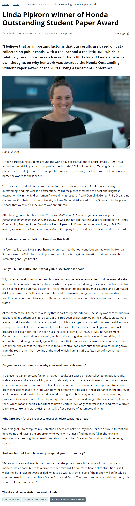

Our work (sponsored by the [L3Pilot project](https://l3pilot.eu/)) was awarded with the [2021 Honda Outstanding Student Paper Award](https://drivingassessment.uiowa.edu/past-conferences/driving-assessment-2021/2021-honda-outstanding-student-paper-award-winners) at the 2021 Driving Assessment Conference. The abstract and the presentation was about driver visual attention before and after a take-over request in automated driving. The data was collected in real traffic on highways in Gothenburg using the [Wizard-of-Oz approach](https://en.wikipedia.org/wiki/Wizard_of_Oz_experiment) to simulate the automated driving feature. We (me and my supervisors) are very happy for the award! 

Below is the interview about the award with me made by Chalmer's communications office.    

